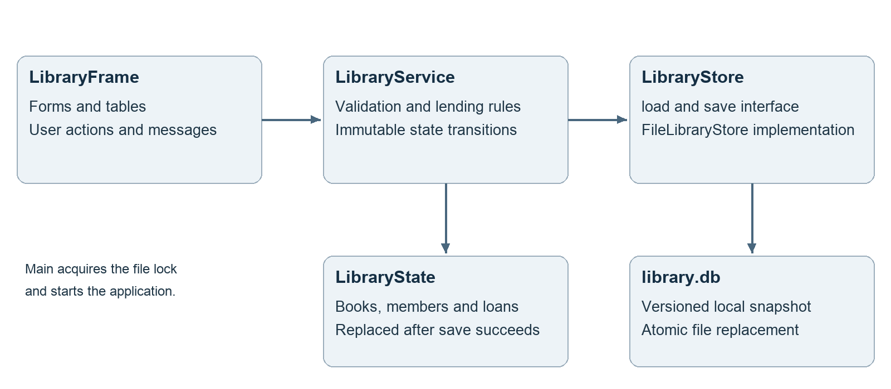
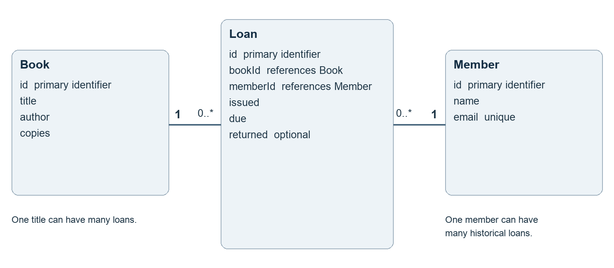
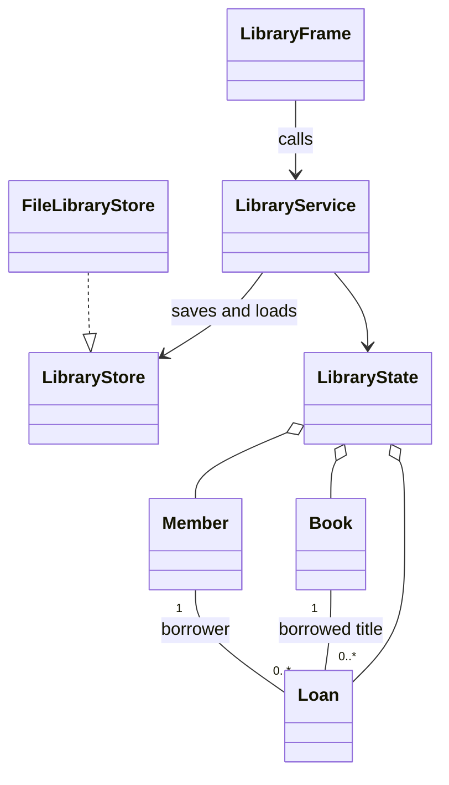
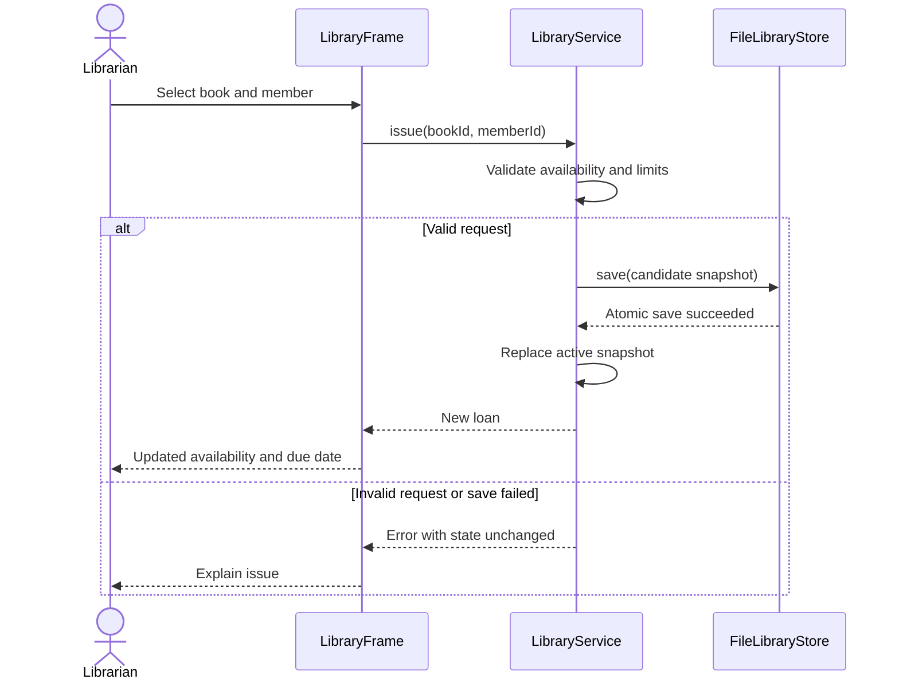

# System architecture

Separation of concerns and modularisation organise responsibilities into understandable components (Washizaki, 2026, chapter 3, section 1.4). In this application, the interface calls the service; the service validates a candidate immutable snapshot and asks the store to save it. The new state becomes active only after a successful save.

Figure 1 Application layers and the save boundary

## Responsibilities

Main locates the selected data directory, holds the application file lock, constructs the service and opens the window. LibraryFrame owns forms, tables and messages. LibraryService owns validation, identifiers, search, stock calculations and lending rules. LibraryStore is the storage interface. FileLibraryStore implements versioned file storage. Book, Member and Loan are immutable records grouped by LibraryState.

## Why these choices fit the project

Swing supplies a desktop interface without third-party packages. A storage interface allows the tests to simulate a failed disk write without changing business logic. Immutable records make successful and rejected operations easier to reason about. One atomic file replacement keeps books, members and loans in a single consistent snapshot.

File operations execute on the interface thread because the intended demonstration dataset is small. A larger system should move storage work to a background worker and use a database. Java’s Swing documentation explains the event dispatch thread constraint (Oracle, n.d.c).

# Data model and persistence design

Figure 2 A loan connects one book title to one member

| Entity | Fields | Integrity rule |
| --- | --- | --- |
| Book | id, title, author, copies | Unique ID and title/author pair; copies 1 to 999. |
| Member | id, name, email | Unique ID and email. |
| Loan | id, bookId, memberId, issued, due, returned | Existing references; valid dates; returned is optional. |
| LibraryState | books, members, loans | Immutable lists forming one snapshot. |

## Relationships and availability

A book title may have many historical loans; a member may have many historical loans. Each loan belongs to exactly one book and one member. At any moment, a title cannot have more active loans than copies and a member cannot have more than three. Physical copies are counted rather than identified individually.

## File format and safe saves

The working file is data/library.db. Despite the extension, it is a versioned UTF-8 text snapshot, not a SQL database. The first line is LIBRARY followed by a tab and version 1. Subsequent B, M and L lines identify books, members and loans. Text fields are Base64 encoded; dates use YYYY-MM-DD; an empty return-date field means the loan is active.

The store writes a temporary file in the same directory and requests an atomic replacement of the working file (Oracle, n.d.b). If the filesystem cannot provide that operation, the save fails instead of using a non-atomic fallback. Loading checks record types, field counts, identifiers, relationships, dates and lending invariants. An invalid file is reported and is not automatically overwritten.

## Editable diagram sources

