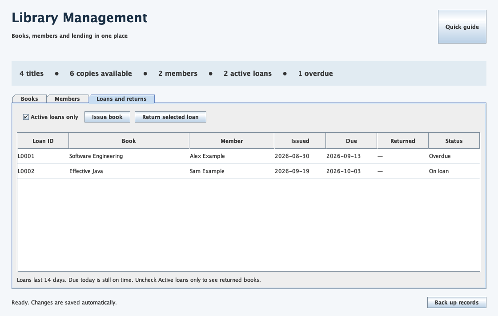

# Application operation

Figure 5 Active loans showing one overdue item

## Start the application

Open the GitHub repository linked at the start of this report, choose Code then Download ZIP, extract the archive and open its folder. On macOS, double-click Start Library.command to compile and launch the application. Keep the Terminal window open during use. A JDK version 17 or later is required. The build and test commands are documented in README.md.

## Lending workflow

- Add a book with one copy, then register a member using a fictional email.
- Search for the book and issue it to that member. Show the due date and reduced availability.
- Register a second member and explain that the unavailable title cannot be issued again.
- Return the original loan. Clear Active loans only to show the return history.
- Close and reopen the application to show that records persist, then save a backup.

## If a problem occurs

For a validation warning, correct the field and confirm again. If startup reports an existing instance, find and use that window. If records cannot be read, preserve the data file and follow the recovery instructions. Do not erase the working file to bypass an error; that would discard its records.
